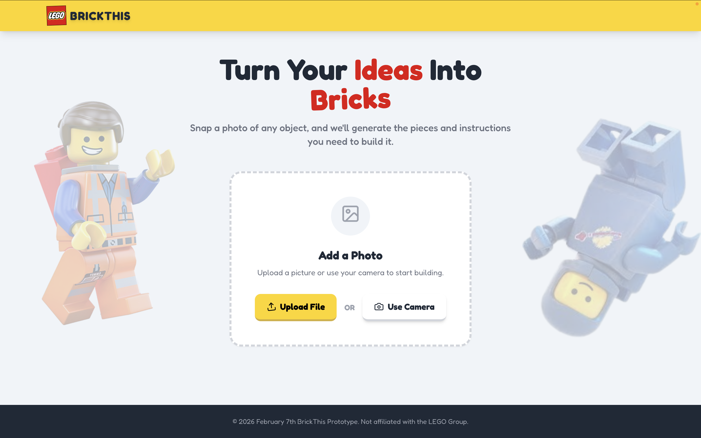
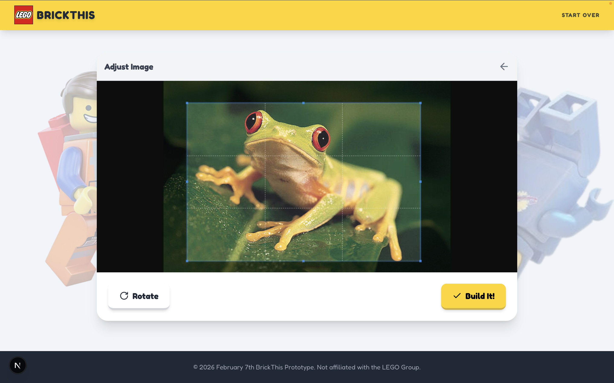
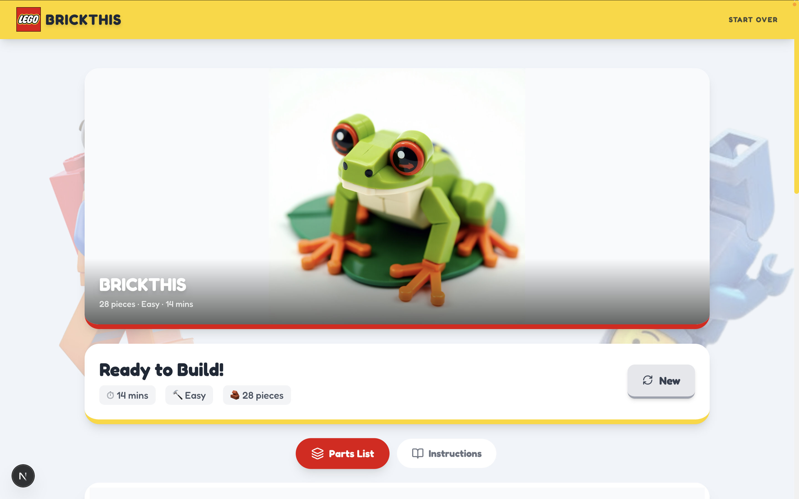
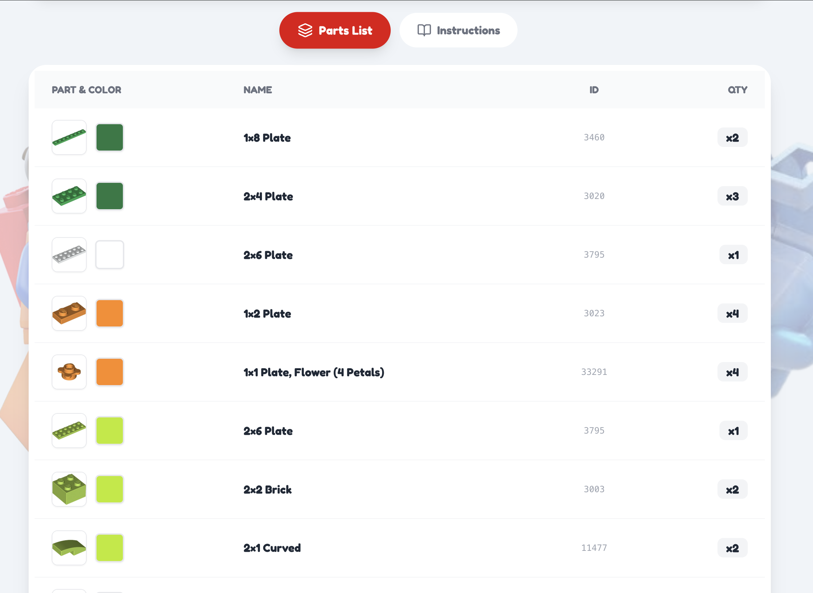
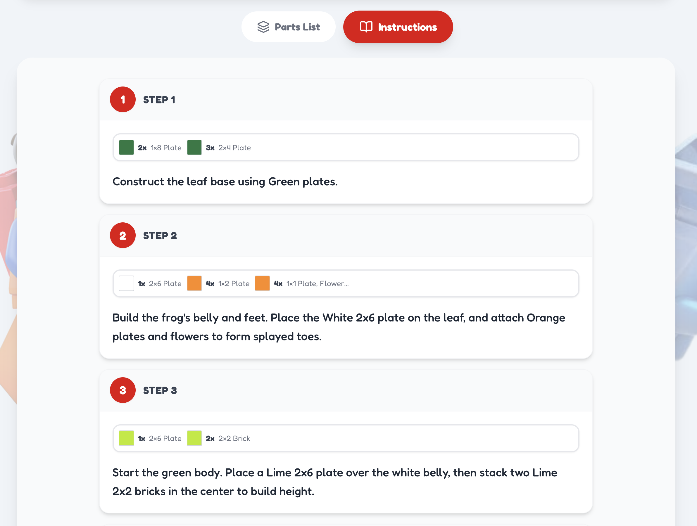

# BrickThis: AI-Powered photo to LEGO instructions!

24-hour ML Hacakathon project. Turn any photo into a LEGO build! Snap or upload an image and get a parts list plus step-by-step instructions—all powered by AI.

## Key Features

- **Photo input** — Upload from files or capture directly with your device camera
- **Smart cropping** — Crop to the object you want to build before analysis
- **AI analysis** — Gemini analyzes the image and designs a real LEGO build
- **Real parts** — Parts list uses actual LEGO piece IDs from Rebrickable
- **Generated visuals** — AI-generated cover image and step illustrations
- **Step-by-step instructions** — Text descriptions plus images for each build step
- **Responsive UI** — Mobile-first design with LEGO-themed styling

## Tech Stack

- Next.js, Tailwind, Autoprefixer, Canvas-confetti, Cropperjs
- Node.js, Flux-dev, Gemini, Jsonrepair, Rebrickable API, Replicate API

## Screenshots

